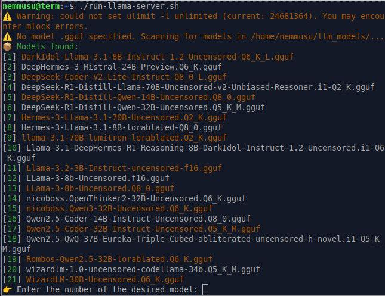

# 🧠 llama-server-launcher

This is a Bash script to automatically launch `llama-server` (from [llama.cpp](https://github.com/ggerganov/llama.cpp)), detects available .gguf models, and selects GPU layers based on your free VRAM.

## 🚀 Features

- Scans `~/llm_models/` for `.gguf` models if none is specified
- Automatically sets `ulimit -l unlimited` for `mlock` if possible
- Dynamically assigns `--n-gpu-layers` based on free VRAM
- Auto-retries with fewer layers if `cudaMalloc` fails
- Colored output for clear UX
- Prompts to choose model if none provided
- Full customization via command-line arguments

## 📂 Default Paths

- **llama.cpp binary**: `~/llama.cpp/build/bin/llama-server`
- **GGUF models directory**: `~/llm_models/`

> These paths can be changed by editing the `LLAMA_SERVER_BIN` and `MODEL_DIR` variables at the top of the script.

## 🧪 Example Usage

```bash
./run_llama_server.sh --model ~/llm_models/my_model.gguf
```

Or just:

```bash
./run_llama_server.sh
```

> The script will scan `~/llm_models` and ask you to select a model interactively.

## 🖼️ Screenshot



## 🧰 CLI Options

| Option               | Description                                              | Default        |
|----------------------|----------------------------------------------------------|----------------|
| `--model <path>`     | Path to your `.gguf` model                               | auto-detected  |
| `--port <number>`    | Port for the server                                      | 10000          |
| `--ctx-size <n>`     | Context size                                             | 4096           |
| `--n-gpu-layers <n>` | GPU layers to allocate (overrides auto-detect)           | dynamic        |
| `--batch-size <n>`   | Batch size                                               | 256            |
| `--main-gpu <id>`    | GPU index to use                                         | 0              |
| `--numa <mode>`      | NUMA mode (e.g., `distribute`)                          | distribute     |
| `--mmap <opt>`       | Use mmap or no-mmap                                      | no-mmap        |
| `--mlock`            | Use mlock to lock model in RAM                          | enabled        |
| `--threads <n>`      | Number of threads to use                                | all cores      |
| `--help`             | Show help message                                        | —              |


## 🛑 Prerequisites

- `llama-server` compiled and available at `~/llama.cpp/build/bin/llama-server`
- One or more `.gguf` models in `~/llm_models`
- `nvidia-smi` available in `PATH` (for GPU VRAM detection)
- Bash shell (recommended: run on Linux)

## 💡 Tips

- If `cudaMalloc` fails at launch, the script will retry with fewer layers until it succeeds.
- Once a working `--n-gpu-layers` value is found, it will be printed for reuse.
- To hardcode your model path or binary path, edit `MODEL_PATH` and `LLAMA_SERVER_BIN` in the script header.

### 🧪 Experimental Notice

This script is functional but experimental, use it as-is.